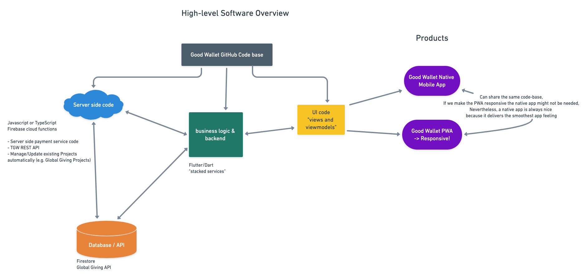
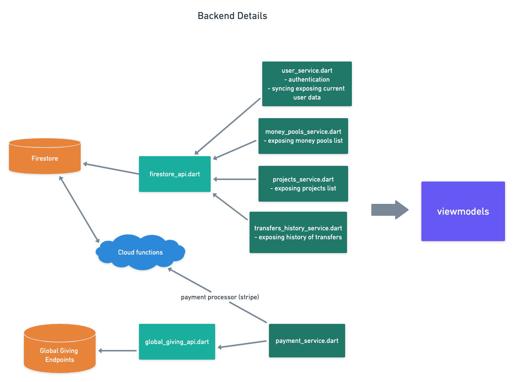

# The Good Wallet
The Good Wallet (TGW) is a novel altruistic payment system, where people can transfer money into a fund that is committed to donations. We want to empower individuals and communities to more easily engage in philanthropic activities and create a positive impact.

# Technical Planning
The following should give a rough outline about the current technical setup of TGW.

## Features
- **Transfer money** (Money from bank to TGW)
    - To other users' Good Wallets or money pools
    - via credit card payment (gpay / apple pay for native mobile version, check feasibility for PWA) or Paypal
- Option to **browse** charities and **donate** (money from TGW foundation to project)
    - Donate from Good Wallet, money pool, or bank account directly (money from user to project, difficulties with tax deductions?) using GlobalGivingAPI
    - Add user favourites
    - Recurring donations
- **Money pools**
    - Create money pool and invite other users to raise together
    - Disburse money pool to multiple users
- **Statistics**
    - User donation statistics (history, area, ...)
    - User fundraising statistics (history, source, ...)
    - Project donation statistics (total donations from TGW users, user top picks, ...)
- **API**
    - API to allow other platforms to integrate TGW
    - Authentication via API
    - Send money to user Good Wallet via TGW API endpoints
    - Manage money pools with API endpoints
- **"Team" Accounts**
    - User's can join "teams" e.g. for corporate money pooling
    - Keep track of team donations / fundraising

## App High-Level Technical Overview
As app architecture and state management solution we use stacked by FilledStacked which realizes an MVVM architecture in flutter [[stacked](https://pub.dev/packages/stacked)] (see below for how to get started with stacked). We use Firebase as a serverless backend solution. 


## Backend Technical Planning

- firestore_api.dart:
    - everything related to reads, writes, ... to firestore
- global_giving_api.dart:
    - handles donations, see [API doc](https://www.globalgiving.org/api/)
- cloud functions:
    - A good chunk of code needs to be implemented as cloud functions, mainly the part where money is transferred. 
- user_service.dart: 
    - Authentication
    - exposes current user
- payment_service.dart:
    - connection to actual payment processor (e.g. stripe)
- transfers_history_service.dart:
    - exposes list of transfers history (incoming / outgoing money from peer-2-peer transfers, donations, money pool transactions, ...
- projects_service.dart:
    - all functionality related to projects
    - exposes list of projects
- money_pools_service.dart:
    - functionality to create, update, delete, disburse money pools and inviting users to it and everything else related to money pools
    - exposes list of money pools

## How We Collaborate
The following describes a few guidelines to follow when contributing to this project.

### How To Get Started With Stacked
- We use the stacked package by FilledStacks which provides a very clean solutions for state management and realizing an MVVM architecture in flutter [[stacked](https://pub.dev/packages/stacked)]
- [This blog post](https://medium.com/flutter-community/a-beginners-guide-to-architecting-a-flutter-app-1e9053211a74) provides a nice introduction to the stacked architecture
- Highly recommended to watch the architecture tutorials summarized [[FilledStack's github repo](https://github.com/FilledStacks/flutter-tutorials)] (especially the tutorials 48, 49, 50). We basically set up the code like explained there. 
- From the FilledStacks I can additionally recommend the tutorials starting from number 38 as well as the new [[boxt'out series](https://www.youtube.com/watch?v=8nVnrdFFBWw&list=PLdTodMosi-BzqMe7fU9Bin3z14_hqNHRA)].
- Below the most important design & architecture prinicples

#### Stacked Architecture Principles (see [here](https://www.filledstacks.com/post/flutter-and-provider-architecture-using-stacked/#how-does-stacked-work))
The architecture functionally consists of only 3 parts. Views, ViewModels and Services. Views on top, the closest to the user, ViewModels are below that taking input from the Views and Services below that which is what the ViewModel's make use of to provide functionality. That's it. It comes with some rules that I highly recommend not to break.

- Views should never MAKE USE of a service directly.
- Views should contain zero to (preferred) no logic. If the logic is from UI only items then we do the least amount of required logic and pass the rest to the ViewModel.
- Views should ONLY render the state in its ViewModel.
- 1 View has 1 ViewModel
- ViewModels for widgets that represent page views are bound to a single View only.
- ViewModels may be re-used if the UI requires the exact same functionality.
- ViewModels should not know about other ViewModels**
Along with the 3 pillars above, something to consider is that any service / class that is not a ViewModel, that makes use of multiple services should be called a manager. This is something that would help distinguish better in code which services depend on other services and which are stand alone services. This is not a HARD rule but it's something to consider.

#### Stacked Architecture Cheatsheet
See [application setup](https://pub.flutter-io.cn/packages/stacked#application-setup) in stacked README.
#### Steps to add a new view
- Create files for new view and viewmodel in appropriate directory
- Register view in routes in `lib/app/app.dart`
- run code generator to generate routes and dependencies `flutter pub run build_runner build --delete-conflicting-outputs`, or use script: `./runCodeGen.sh`
- navigate to new screen with navigation service, e.g.:
```
Future navigateToTransferView() async {
   await _navigationService.navigateTo(Routes.transferView);
}
```

#### Steps to add new service
- Create service class and register it as a dependency in `lib/app/app.dart` as a lazy singleton
- run code generator (see above)

### Other development considerations
#### Documentation and logs
Documentation of classes and functions is very useful and is desired. 
Sometimes a well chosen naming is good enough, however, to describe what is happening. 
What is very important and useful is to add reasonable log outputs to your code, especially in the service classes. You can instantiate a custom logger with `getLogger("<name of file>")` where we follow the convention to name the logger after the file it is used in. Please consider these [guidelines](https://www.filledstacks.com/post/flutter-logging-a-guide-to-use-it-effectively/) to write logs and also see [logger on pub.dev](https://pub.dev/packages/logger).

#### Git workflow
We follow the git feature branch workflow, see for example [here](https://www.atlassian.com/git/tutorials/comparing-workflows/feature-branch-workflow).

#### Learning Material
- Learning UI: [Layouts in Flutter](https://flutter.dev/docs/development/ui/layout)
- [Flutter Step-by-step guide (blog post)](https://www.solutelabs.com/blog/flutter-tutorial-for-beginners-step-by-step-guide)
- Official flutter material
  - [Cookbook: Useful Flutter samples](https://flutter.dev/docs/cookbook)
  - [online documentation](https://flutter.dev/docs)
  - [Performance best practies](https://flutter.dev/docs/perf/rendering/best-practices)

#### Further comments
- Use proper Flutter code formatting [[flutter formatting](https://flutter.dev/docs/development/tools/formatting)]
- Read style guides [[official dart page](https://dart.dev/guides/language/effective-dart/style)], [[random medium article](https://medium.com/nonstopio/flutter-best-practices-c3db1c3cd694)]
- Take your time to think about meaningful names for variables/classes/filename/...everything. Will help sooo much to understand the code later on


## More Things

### Git workflow - for everyone that has never used git
I think we should follow the feature branch workflow [[explanation](https://www.atlassian.com/git/tutorials/comparing-workflows/feature-branch-workflow)]. We're quite a few people and I think it would be nice to always have one version of the app that is state-of-the-art and more importantly works!; this is the version in the `master` branch (please read about what branches are in git e.g. on the above webpage). Whenever you work on the code, just create a new branch and `commit` your changes in this branch first. Then we don't interefere with each other in the development and we can also discuss the code in github pull requests!

#### Here a short blob I wrote on git workflow once upon a time:
checkout latest master in your working directory and get updates from remote
```
git checkout master; git pull
```
create new branch and directly check it out (with `-b`)
```
git checkout -b my-awesome-new-feature
```
Now, develop your new feature, push it, and create a pull-request on github webpage with potentially assigning the issue. By pushing early we have the option to talk about details in the pull request during ongoing developments and can help each other. To push the branch, do something like this:
```
git push --set-upstream origin my-awesome-new-feature
```
I can only recommend to adopt a “commit early, push often” policy during feature developments ([[see nice read](https://www.worklytics.co/commit-early-push-often/)]).
The above command doesn't push anything if you haven't committed a change yet. A commit is (NOT LIKE IN SVN!) not uploaded!!! (that's what git push does) but only creates a local snapshot of the current code. 
```
git commit -m "add awesome function" path/to/awesome/function; 
```
(I usually use `git add file1 file2` and then commit everything at once with `git commit -m "my changes"`.)
Once you think you are done, check for potential changes that happened to master in the meantime (from other people), merge them into your branch with
```
git pull origin master # (one command to fetch updates in remote and merge master)
```
Here, you might encounter cases where you can’t merge because of local changes that aren’t committed or you will get merge conflicts you need to resolve. If you have done changes to files that you want to disregard you can e.g. stash them with `git stash` or just checkout the file from the remote master with `git checkout origin/master file/with/your/wrong/changes`  and then `git pull origin master` again. Afterwards, push your branch once more to the remote with
```
git push
```
You can also nicely follow the changes in the code in the github pull request and once you think everything is working and nice, you can merge it to `master`!
Afterwards, you might want to switch to `master` again in your local working dir and get the changes from the remote.
```
git checkout master; git pull 
```


